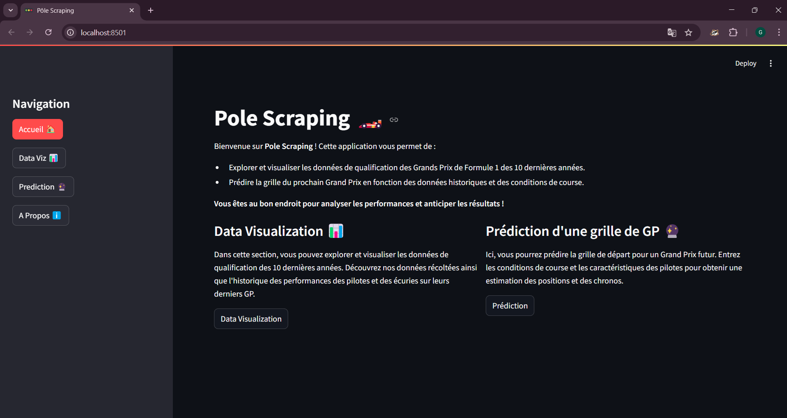
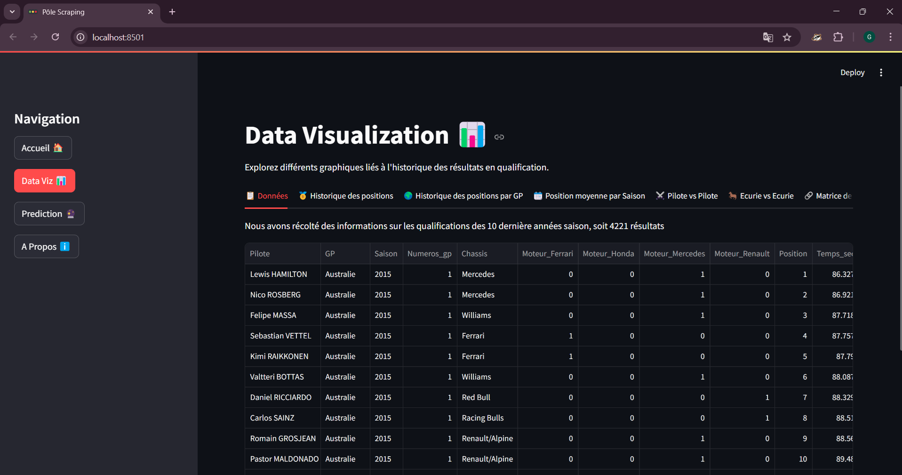
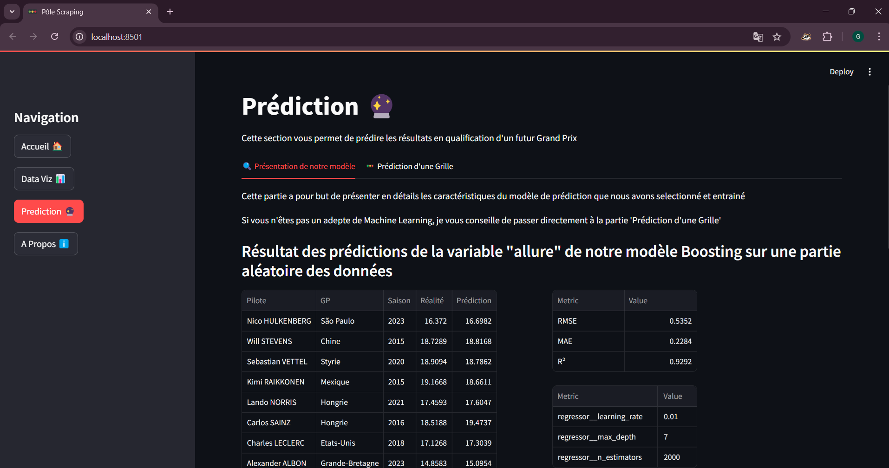
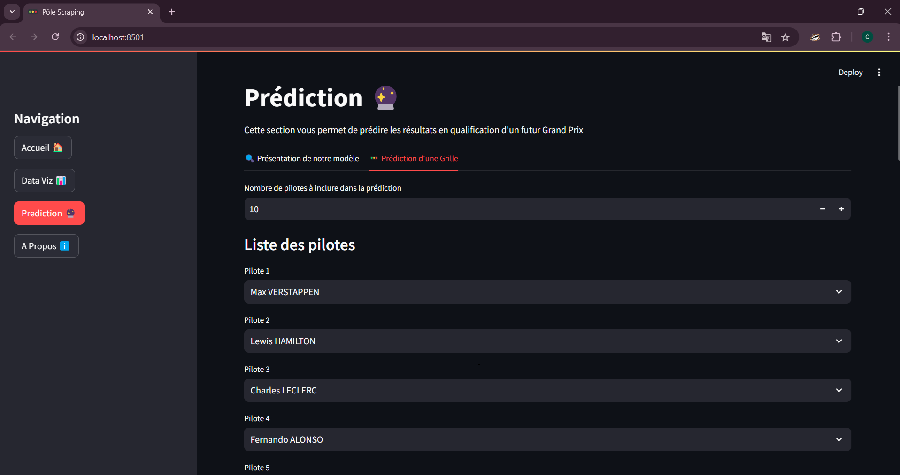

# Pole_Scraping

Bienvenue dans le projet **Pole_Scraping**, une application combinant les techniques de web scraping et de machine learning pour analyser et prédire les performances en qualifications de Formule 1.

---

## Pourquoi Pole Scraping ?
Dans le cadre de notre cours intitulé « Web Scraping et Machine Learning » de M2 MECEN à l'Université de Tours, nous avons choisi de réaliser un projet visant à prédire une grille de départ en Formule 1 (résultats des qualifications).
Nous avons opté pour les qualifications car elles sont confrontées à beaucoup moins d'aléas que la course. Les problèmes mécaniques y sont moins fréquents, et les accidents entre pilotes sont rares, car les qualifications ne reposent pas sur une confrontation directe entre eux.

## Organisation du projet
### Partie 1 :
Création d'une base de données. Pour cela, nous avons utilisé la méthode de web scraping, qui consiste à extraire des données directement depuis des sites internet afin de créer une base de données personnalisée. Nous sommes notamment aller chercher nos informations sur les sites StatsF1 et Wikipedia.

### Partie 2 :
Nettoyage du dataset. Une fois nos données récoltées, nous avons nettoyé notre dataset dans le but de rendre nos données compréhensibles et exploitables.

### Partie 3 :
Utilisation du Machine Learning pour réaliser les prédictions. Une fois nos données nettoyées, nous avons selectionné notre varibale à prédire, c'est à dire la variable "Allure", puis nous avons entrainer plusieurs modèle de Machine Learning. Nous avons ensuite selectionné le plus performant puis nous l'avons intégré a notre application.

### Partie 4 :
Création d'une API. Une fois nos données prêtes et notre modèle sélectionné, nous avons créer une application avec Streamlit, qui permet aux utilistauers de parcouri les données et de prédire une grille en rentrant les informations nécessaires.

---

## Fonctionnalités Principales
- **Web Scraping** : Collecte automatisée de données depuis des sources fiables.
- **Nettoyage de Données** : Prétraitement et organisation des données pour une meilleure qualité d'analyse.
- **Prédiction Machine Learning** : Modèle de boosting pour prédire les allures des pilotes.
- **Visualisation Intéractive** : Dashboard développé avec Streamlit pour explorer les données et prédictions.

---

## Technologies Utilisées
- **Langage** : Python (3.9 ou supérieur)
- **Bibliothèques Principales** :
  - Web Scraping : `BeautifulSoup`, `Selenium`
  - Data Cleaning : `polars`
  - Machine Learning : `scikit-learn`, `numpy`, `pandas`
  - Visualisation : `Streamlit`, `plotly`
- **Outils** :
  - Gestion de version : `Git`
  - IDE : `VS Code`
  - Plateformes de développement : `GitHub`

---

## Installation et Utilisation

### Prérequis
1. **Python** : Assurez-vous que Python 3.9 ou supérieur est installé.
2. **Git** : Installez Git pour cloner le dépôt.

### Dépendances
La gestion des dépendances a été opéré avec `UV`. Pour travailler sur ces fichiers il vous suffit de :

1. Clonez ce dépôt Git
2. Lancer :

   ```bash
   pip install uv
   ```
   ```bash
   uv sync
   ```
   uv sync doit normalement s'occuper d'installer les dépendances avec les bonnes version de manière automatique
---

### Lancer l'Application
Exécutez la commande suivante pour lancer l'application Streamlit :

   ```bash
   streamlit run streamlit_app.py
   ```

---

### Tests
1. Exécutez la commande suivante pour lancer les tests :
   
   ```bash
   pytest
   ```
3. Les tests couvrent les modules de scraping, nettoyage, machine learning et visualisation. (Attention : certains tests, notamment ceux qui concernent le scraping, lancent le Webdriver de Selenium, plus précisement le driver chromedriver)

---

## Fonctionnalités de l'Application
- **Visualisation des données venant de l'historique en qualifactions de ces 10 dernières années**.
- **Tableaux et graphiques interactifs**
- **Prédiction d'une futur grille de GP**
- **Des informations supplémentaires sur notre projet**

## Présentation de l'Application
### Acceuil
Lorsque vous allez lancer l'application, vous tomberez sur cette page d'acceuil :



Vous pourrez ensuite naviguer parmis les 3 onglets présent dans la barre de navigation :

### Data Viz



### Prédiction 
Dans cette partie, vous trouverez des informations sur le modèle que nous avons choisit



Ensuite vous pourrez accéder à la partie "Prédiction d'une grille" où vous pourrez rentrer toutes les informations nécessaires à la prédiction 



Voici un exemple de sortie de l'application (GP de Monaco 2025)


## Auteurs

- **Gabin SENGEL** : https://www.linkedin.com/in/gabin-sengel/
- **Romain SIETTE** : https://www.linkedin.com/in/romain-siette/
---


